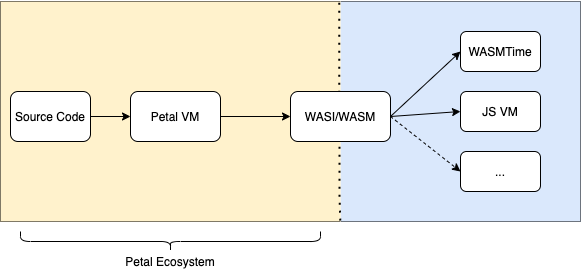

# Petal Lang

</img>

## What is Petal

Petal is a statically-typed programming language and runtime that mostly adheres to the ECMAScript 2020 and Typescript 4+[1]() specifications. 

It does so in a way so as to promote low cognitive burn in learning a new language. As a Typescript developer, you should be able to pick up the language and understand the semantics immediately. 

However, there are several key differences in the execution and semantic representations between the two languages. These differences are subtle, and not crucial for one to start hacking in Petal. The features that distinguish the Petal VM and language are crucial in writing _effective_ Petal code, and serve as the justification for switching. In other words, if none of these features seem particularly palatable or useful to you, then Petal _might_ not be the first language you reach for. 

It only might not be because there are [some good reasons why one might make the switch](), but for now we'll consider this outside of the scope of this document. 

### Key Language Differences

* All functions are _fibers_, implemented under the hood as stackful coroutines.
    * Any function may yield. You can still write generator functions, but the syntax is only supported for backwards compatibility. In this sense, all functions are iterable.
    * Fibers are cooperatively scheduled and maintained by the PetalVM.
    * As first-class coroutines, a fiber may suspend from anywhere in the call stack.
* Function are automatically curried.
    * `const sum = (a: number) => (b: number) => a+b`
        * `sum(1, 2) == 3`
        * `sum(1) == (b: number) => number`
* Standard library provides zero-cost abstractions for Algebraic Data Types
    * Option
    * Result
    * Task (Promise aliases to task, is a strict subset of Task)
* Support for Linear Types
    * Stretch goal, considered in Road Map.    
* Omits support for ES6 classes.
    * Will make a best-faith effort to transform classes in parsing phase, but considers the use of classes harmful.
    * Will emit warnings.

### Why The Split at WASM/WASI

The goal of Petal is to provide a wonderful environment for you to write and execute code. You should be able to take that experience into any environment you see fit. A WASI/WASM target allows us to focus on writing a blazing fast VM and bytecode instruction set while offloading platform-independence and low-level optimization strategies (such as JIT compilation) to world-class runtimes -- such as V8 and WASMTime.

### Pipeline 

</img>

Add more about pipeline later

